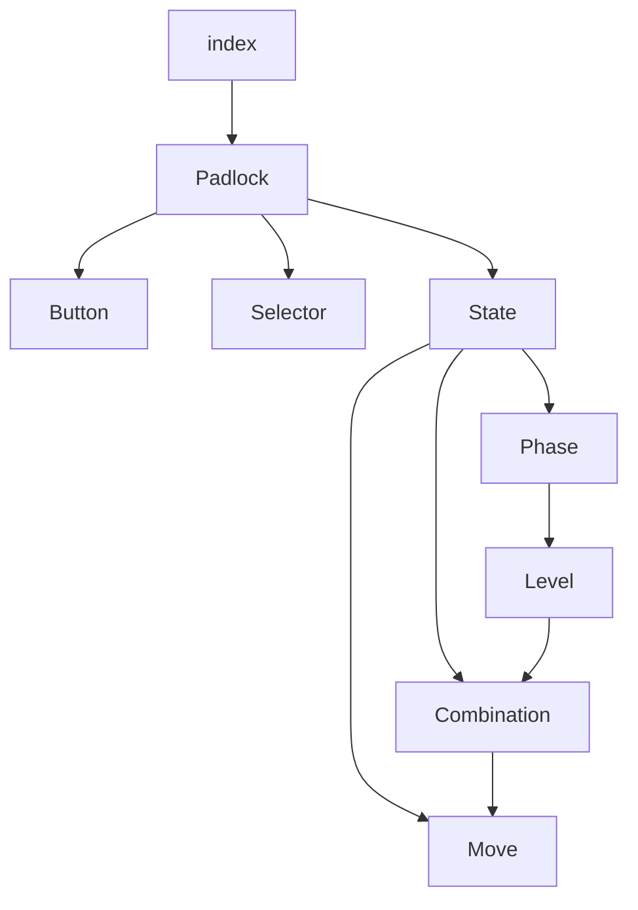

# Class Dependency Graph

```mermaid
graph TD
    index --> Padlock
    Padlock --> Button
    Padlock --> Selector
    Padlock --> State
    State --> Move
    State --> Combination
    State --> Phase
    Phase --> Level
    Level --> Combination
    Combination --> Move
```
